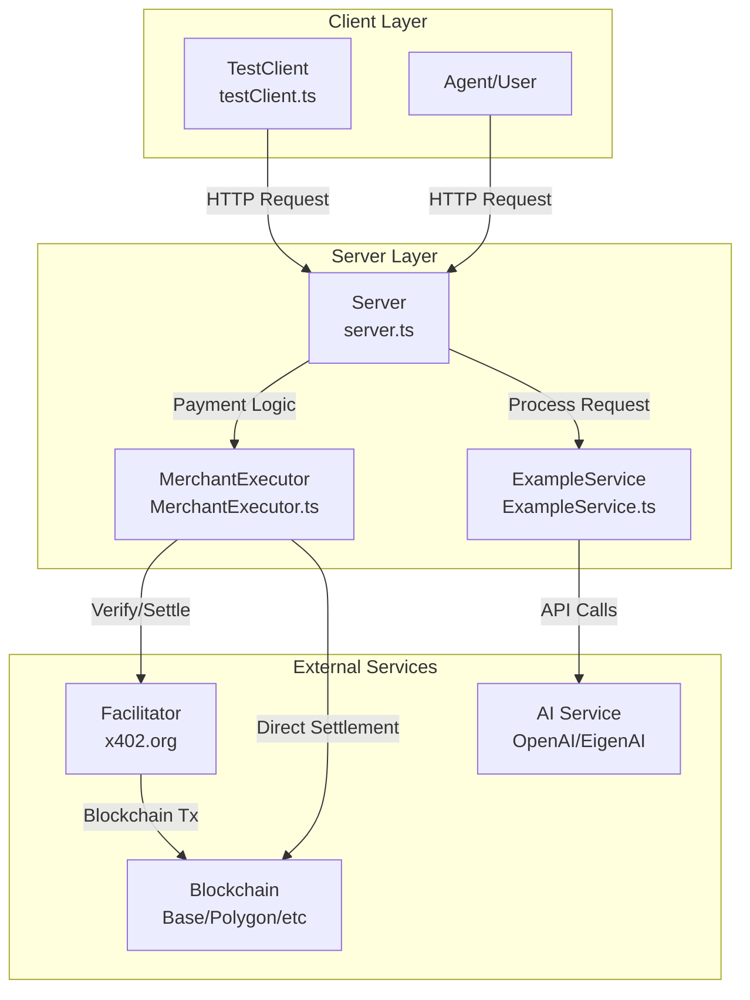
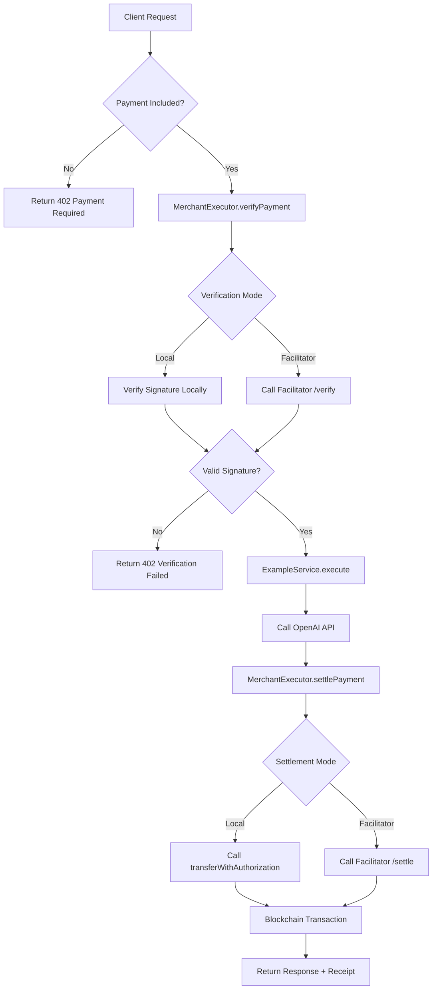
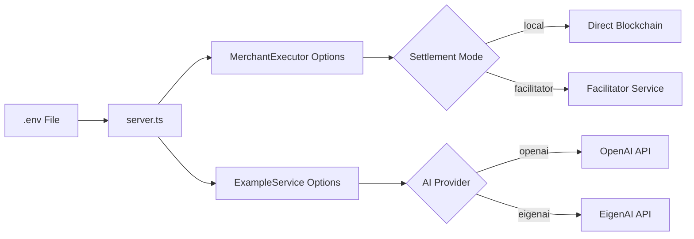

# Architecture Guide

This guide explains the codebase structure and what each file does in the x402 implementation.

## Project Structure

```
x402-starter-kit/
├── src/                          # Main source code
│   ├── server.ts                 # HTTP server & payment orchestration
│   ├── MerchantExecutor.ts       # Payment verification & settlement
│   ├── ExampleService.ts         # Service logic (OpenAI integration)
│   ├── testClient.ts             # Test client for payment flow
│   └── x402Types.ts              # TypeScript type definitions
├── docs/                         # Documentation
├── test-facilitator.js           # Facilitator testing script
├── check-wallet.js               # Wallet balance checker
├── package.json                  # Dependencies & scripts
├── tsconfig.json                 # TypeScript configuration
└── .env                          # Environment variables
```

## Core Architecture



## File-by-File Breakdown

### 1. `src/server.ts` - Main HTTP Server

**Purpose:** Entry point that orchestrates the entire payment flow.

**Key Responsibilities:**
- HTTP server setup (Express.js)
- Request routing (`/health`, `/process`, `/test`)
- Payment requirement generation
- Payment verification coordination
- Request processing coordination
- Response formatting

**Key Code Sections:**

#### Environment Configuration (Lines 21-52)
```typescript
const PAY_TO_ADDRESS = process.env.PAY_TO_ADDRESS;
const NETWORK = process.env.NETWORK || 'base-sepolia';
const OPENAI_API_KEY = process.env.OPENAI_API_KEY;
const SETTLEMENT_MODE_ENV = process.env.SETTLEMENT_MODE?.toLowerCase();
```

#### Payment Check Logic (Lines 249-284)
```typescript
// Check if payment is missing
if (!paymentPayload || paymentStatus !== 'payment-submitted') {
  const paymentRequired = merchantExecutor.createPaymentRequiredResponse();
  return res.json({
    success: false,
    error: 'Payment Required',
    task, events
  });
}
```

#### Payment Verification (Lines 288-321)
```typescript
const verifyResult = await merchantExecutor.verifyPayment(paymentPayload);
if (!verifyResult.isValid) {
  return res.status(402).json({
    error: 'Payment verification failed',
    reason: verifyResult.invalidReason
  });
}
```

#### Service Processing (Line 333)
```typescript
// Only called AFTER payment verification
await exampleService.execute(context, eventQueue);
```

#### Payment Settlement (Line 338)
```typescript
// Execute blockchain transaction
const settlement = await merchantExecutor.settlePayment(paymentPayload);
```

**Flow Control:**
1. Receive request → Check payment → Verify → Process → Settle → Respond

---

### 2. `src/MerchantExecutor.ts` - Payment Engine

**Purpose:** Handles all payment-related logic including verification and settlement.

**Key Responsibilities:**
- Payment requirements generation
- Signature verification (local or via facilitator)
- Blockchain settlement (local or via facilitator)
- Network and token configuration
- Error handling and logging

**Key Code Sections:**

#### Built-in Network Configuration (Lines 37-116)
```typescript
const BUILT_IN_NETWORKS: Record<BuiltInNetwork, {
  chainId?: number;
  assetAddress: string;
  assetName: string;
  explorer?: string;
}> = {
  'base-sepolia': {
    chainId: 84532,
    assetAddress: '0xEF2C3C652033e9d27F9630EE6717e7fE59276C92',
    assetName: 'USDC',
    explorer: 'https://sepolia.basescan.org',
  },
  // ... other networks
};
```

#### Payment Requirements Generation (Lines 192-202)
```typescript
this.requirements = {
  scheme: 'exact',
  network: options.network,
  asset: assetAddress,
  payTo: options.payToAddress,
  maxAmountRequired: this.getAtomicAmount(options.price),
  resource: options.resourceUrl || 'https://merchant.local/process',
  description: 'AI request processing service',
  mimeType: 'application/json',
  maxTimeoutSeconds: 600,
  extra: { name: assetName, version: assetVersion || '2' }
};
```

#### Local Signature Verification (Lines 352-457)
```typescript
private verifyPaymentLocally(payload: PaymentPayload, requirements: PaymentRequirements): VerifyResult {
  // Extract signature and authorization
  const authorization = exactPayload?.authorization;
  const signature = exactPayload?.signature;
  
  // Verify EIP-712 signature
  const recovered = ethers.verifyTypedData(domain, TRANSFER_AUTH_TYPES, authorization, signature);
  
  if (recovered.toLowerCase() !== authorization.from.toLowerCase()) {
    return { isValid: false, invalidReason: 'Signature does not match payer address' };
  }
  
  return { isValid: true, payer: recovered };
}
```

#### Direct Blockchain Settlement (Lines 459-534)
```typescript
private async settleOnChain(payload: PaymentPayload, requirements: PaymentRequirements): Promise<SettlementResult> {
  const usdcContract = new ethers.Contract(requirements.asset, abi, this.settlementWallet);
  
  const tx = await usdcContract.transferWithAuthorization(
    authorization.from, authorization.to, authorization.value,
    authorization.validAfter, authorization.validBefore, authorization.nonce,
    parsedSignature.v, parsedSignature.r, parsedSignature.s
  );
  
  const receipt = await tx.wait();
  return { success: receipt?.status === 1, transaction: receipt?.hash };
}
```

#### Facilitator Communication (Lines 553-581)
```typescript
private async callFacilitator<T>(endpoint: 'verify' | 'settle', payload: PaymentPayload): Promise<T> {
  const response = await fetch(`${this.facilitatorUrl}/${endpoint}`, {
    method: 'POST',
    headers: this.buildHeaders(),
    body: JSON.stringify({
      x402Version: payload.x402Version ?? 1,
      paymentPayload: payload,
      paymentRequirements: this.requirements,
    }),
  });
  
  return (await response.json()) as T;
}
```

**Two Operating Modes:**
- **Facilitator Mode:** Delegates to external facilitator service
- **Direct Mode:** Handles verification and settlement locally

---

### 3. `src/ExampleService.ts` - Service Logic

**Purpose:** Example implementation of a paid service (OpenAI integration).

**Key Responsibilities:**
- Process user requests after payment verification
- Call external APIs (OpenAI/EigenAI)
- Format responses
- Handle service errors

**Key Code Sections:**

#### Service Configuration (Lines 37-78)
```typescript
constructor({ apiKey, baseUrl, provider, model, temperature = 0.7, maxTokens = 500 }: ExampleServiceOptions) {
  if (provider === 'openai' && !apiKey) {
    throw new Error('OPENAI_API_KEY is required when using the OpenAI provider');
  }
  
  this.openai = new OpenAI(clientOptions);
  this.model = model ?? (provider === 'eigenai' ? 'gpt-oss-120b-f16' : 'gpt-4o-mini');
}
```

#### Request Processing (Lines 80-158)
```typescript
async execute(context: RequestContext, eventQueue: EventQueue): Promise<void> {
  console.log('✅ Payment verified, processing request...');
  
  // Extract user message
  const userMessage = context.message?.parts
    ?.filter((part: any) => part.kind === 'text')
    .map((part: any) => part.text)
    .join(' ') || 'Hello';
  
  // Call OpenAI API (using your real API key)
  const completion = await this.openai.chat.completions.create({
    model: this.model,
    messages: [
      { role: 'system', content: 'You are a helpful AI assistant.' },
      { role: 'user', content: userMessage }
    ],
    temperature: this.temperature,
    max_tokens: this.maxTokens,
  });
  
  const response = completion.choices[0]?.message?.content || 'No response generated';
  
  // Update task with response
  task.status.state = TaskState.COMPLETED;
  task.status.message = {
    messageId: `msg-${Date.now()}`,
    role: 'agent',
    parts: [{ kind: 'text', text: response }]
  };
}
```

**Important:** This service only runs AFTER payment is verified. Replace this with your own service logic.

---

### 4. `src/testClient.ts` - Test Client

**Purpose:** Demonstrates how to implement an x402 client that can make payments.

**Key Responsibilities:**
- Create payment authorizations
- Sign EIP-712 typed data
- Handle 402 responses
- Retry requests with payments
- Test the complete flow

**Key Code Sections:**

#### Payment Authorization Creation (Lines 69-107)
```typescript
async function createPaymentPayload(paymentRequired: any, wallet: Wallet): Promise<PaymentPayload> {
  const requirement = selectPaymentRequirement(paymentRequired);
  
  // Create authorization object
  const authorization = {
    from: wallet.address,
    to: requirement.payTo,
    value: requirement.maxAmountRequired,
    validAfter: '0',
    validBefore: String(now + requirement.maxTimeoutSeconds),
    nonce: generateNonce(),
  };
  
  // Create EIP-712 domain
  const domain = {
    name: requirement.extra?.name || 'USDC',
    version: requirement.extra?.version || '2',
    chainId: getChainId(requirement.network),
    verifyingContract: requirement.asset,
  };
  
  // Sign typed data (off-chain signature)
  const signature = await wallet.signTypedData(domain, TRANSFER_AUTH_TYPES, authorization);
  
  return { x402Version: 1, scheme: requirement.scheme, network: requirement.network, payload: { signature, authorization } };
}
```

#### Payment Flow Implementation (Lines 174-251)
```typescript
async sendPaidRequest(text: string): Promise<AgentResponse> {
  // Step 1: Send initial request
  const initialResponse = await this.sendRequest(text);
  
  if (!initialResponse.x402) {
    return initialResponse; // No payment required
  }
  
  // Step 2: Create payment
  const paymentPayload = await createPaymentPayload(initialResponse.x402, this.wallet);
  
  // Step 3: Submit request with payment
  const message: Message = {
    messageId: `msg-${Date.now()}`,
    role: 'user',
    parts: [{ kind: 'text', text: text }],
    metadata: {
      'x402.payment.payload': paymentPayload,
      'x402.payment.status': 'payment-submitted',
    },
  };
  
  const paidResponse = await fetch(`${this.agentUrl}/process`, {
    method: 'POST',
    headers: { 'Content-Type': 'application/json' },
    body: JSON.stringify({ message, taskId, contextId }),
  });
  
  return paidResponse.json();
}
```

**Usage Example:**
```typescript
const client = new TestClient(CLIENT_PRIVATE_KEY);
const response = await client.sendPaidRequest('Tell me a joke!');
```

---

### 5. `src/x402Types.ts` - Type Definitions

**Purpose:** TypeScript interfaces and types for the x402 protocol.

**Key Types:**

#### Message Structure
```typescript
export interface Message {
  messageId: string;
  role: 'user' | 'agent';
  parts: MessagePart[];
  metadata?: Record<string, any>;
}

export interface MessagePart {
  kind: 'text' | 'image' | 'audio';
  text?: string;
  data?: string;
  mimeType?: string;
}
```

#### Task Management
```typescript
export enum TaskState {
  INPUT_REQUIRED = 'input-required',
  PROCESSING = 'processing', 
  COMPLETED = 'completed',
  FAILED = 'failed',
}

export interface Task {
  id: string;
  contextId: string;
  status: TaskStatus;
  metadata?: Record<string, any>;
  artifacts?: any[];
}
```

---

## Supporting Files

### `test-facilitator.js` - Facilitator Testing

**Purpose:** Test communication with the x402 facilitator service.

**What it does:**
- Creates test payment payloads
- Calls facilitator `/verify` endpoint
- Calls facilitator `/settle` endpoint  
- Shows facilitator response format

**Usage:**
```bash
node test-facilitator.js
```

### `check-wallet.js` - Wallet Inspector

**Purpose:** Check wallet balances and network status.

**What it does:**
- Shows ETH and USDC balances
- Displays network information
- Provides faucet links for testnet tokens
- Calculates how many tests can be run

**Usage:**
```bash
node check-wallet.js
```

## Data Flow Diagram



## Configuration Flow



## Error Handling Strategy

### Server-Side Error Handling

1. **Configuration Errors** (startup)
   - Missing required environment variables
   - Invalid network configurations
   - API key validation

2. **Request Errors** (runtime)
   - Missing payment data
   - Invalid payment signatures
   - Expired authorizations

3. **Service Errors** (processing)
   - OpenAI API failures
   - Network timeouts
   - Rate limiting

4. **Settlement Errors** (blockchain)
   - Insufficient balances
   - Contract call failures
   - Network congestion

### Client-Side Error Handling

1. **Payment Creation Errors**
   - Wallet connection issues
   - Insufficient funds
   - Signature failures

2. **Network Errors**
   - API unavailability
   - Timeout errors
   - Invalid responses

## Security Considerations

### Server Security
- Validate all payment data before processing
- Verify signatures cryptographically
- Implement rate limiting
- Secure private key storage
- Monitor for replay attacks

### Client Security  
- Secure private key management
- Validate payment requirements
- Check transaction receipts
- Implement spending limits

## Performance Considerations

### Optimization Points
- Cache network configurations
- Batch multiple requests
- Implement connection pooling
- Use efficient JSON parsing
- Monitor memory usage

### Scalability
- Horizontal scaling with load balancers
- Database for payment tracking
- Queue systems for high volume
- CDN for static responses

## Next Steps

- [Token Support Guide](./token-support-guide.md) - Configure different tokens
- [Facilitator Guide](./facilitator-guide.md) - Settlement options
- [Configuration Reference](./configuration-reference.md) - All environment variables
- [API Reference](./api-reference.md) - Complete API documentation

---

*This architecture enables scalable, secure, and autonomous payment processing for the machine economy.*
