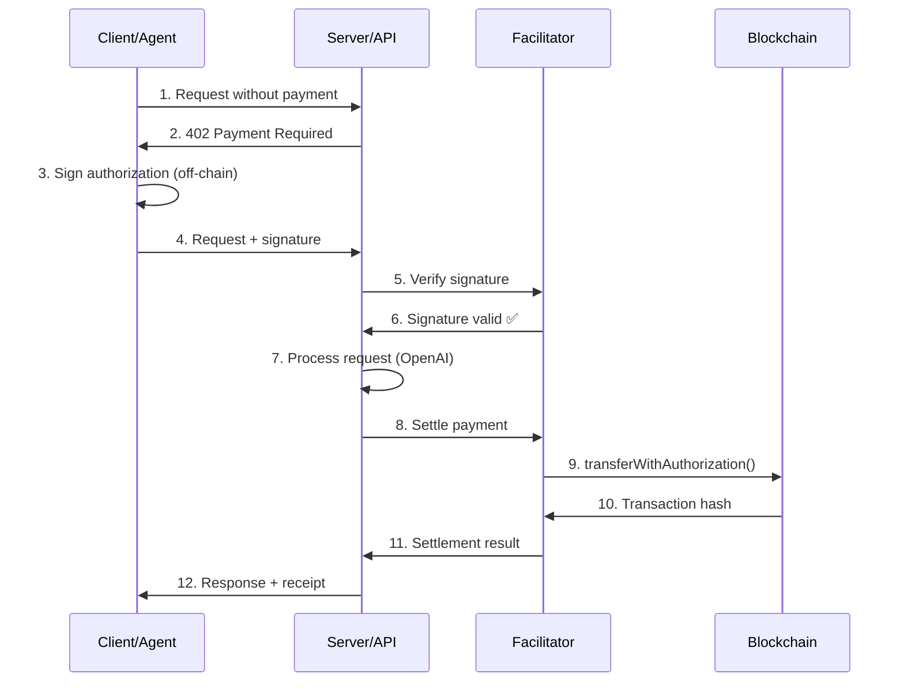
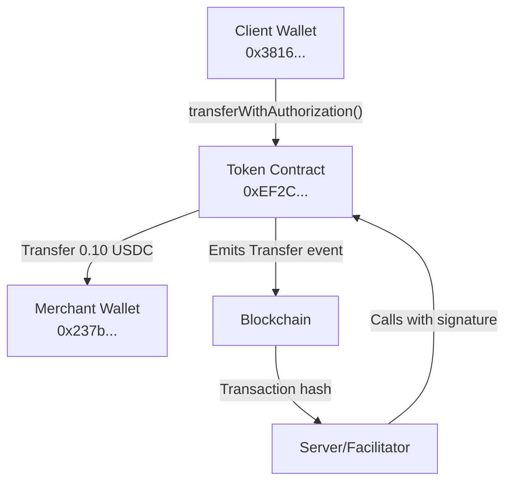

# Payment Flow Guide

This guide explains the complete x402 payment flow with detailed technical examples and diagrams.

## Overview

The x402 protocol uses **Case 2: Signed Intent** - clients sign payment authorizations, and servers execute the blockchain transactions.

## Complete Payment Flow

### Step-by-Step Process



### Detailed Flow

#### Step 1: Initial Request (No Payment)

**Client sends request:**
```http
POST /process HTTP/1.1
Content-Type: application/json

{
  "message": {
    "parts": [{
      "kind": "text", 
      "text": "Tell me a joke about TypeScript"
    }]
  }
}
```

**Code location:** `src/testClient.ts` line 142-148

#### Step 2: Server Requires Payment

**Server responds with 402:**
```http
HTTP/1.1 200 OK
Content-Type: application/json

{
  "success": false,
  "error": "Payment Required",
  "task": {
    "status": {
      "message": {
        "metadata": {
          "x402.payment.required": {
            "x402Version": 1,
            "accepts": [{
              "scheme": "exact",
              "network": "base-sepolia",
              "asset": "0xEF2C3C652033e9d27F9630EE6717e7fE59276C92",
              "payTo": "0x237b7244ea07073e86e6f11c42db3a95378b181f",
              "maxAmountRequired": "100000",
              "resource": "/process",
              "description": "AI request processing service",
              "maxTimeoutSeconds": 600,
              "extra": {
                "name": "Test USDC",
                "version": "1"
              }
            }]
          }
        }
      }
    }
  }
}
```

**Code location:** `src/server.ts` line 249-283

#### Step 3: Client Signs Authorization

**Client creates EIP-712 signature:**
```javascript
// Create authorization object
const authorization = {
  from: "0x3816BA21dCC9dfD3C714fFDB987163695408653F",
  to: "0x237b7244ea07073e86e6f11c42db3a95378b181f", 
  value: "100000",
  validAfter: "0",
  validBefore: "1762949756",
  nonce: "0x91db6b42d4c047ece4c04a69f020716d6b403567f2b4217e516fde76df6a8579"
};

// Create EIP-712 domain
const domain = {
  name: "Test USDC",
  version: "1", 
  chainId: 84532,
  verifyingContract: "0xEF2C3C652033e9d27F9630EE6717e7fE59276C92"
};

// Sign typed data (NO blockchain transaction)
const signature = await wallet.signTypedData(domain, TRANSFER_AUTH_TYPES, authorization);
// Result: "0xa9d468eaeceead272c80cf174fc06d23f4e83eefb4dda7baecc3c9b2b2981da1..."
```

**Code location:** `src/testClient.ts` line 92-96

**Important:** This is just a cryptographic signature, not a blockchain transaction. No money moves yet.

#### Step 4: Client Submits Request with Payment

**Client sends request with signature:**
```http
POST /process HTTP/1.1
Content-Type: application/json

{
  "message": {
    "parts": [{
      "kind": "text",
      "text": "Tell me a joke about TypeScript"
    }],
    "metadata": {
      "x402.payment.payload": {
        "x402Version": 1,
        "scheme": "exact", 
        "network": "base-sepolia",
        "payload": {
          "signature": "0xa9d468eaeceead272c80cf174fc06d23f4e83eefb4dda7baecc3c9b2b2981da1...",
          "authorization": {
            "from": "0x3816BA21dCC9dfD3C714fFDB987163695408653F",
            "to": "0x237b7244ea07073e86e6f11c42db3a95378b181f",
            "value": "100000",
            "validAfter": "0", 
            "validBefore": "1762949756",
            "nonce": "0x91db6b42d4c047ece4c04a69f020716d6b403567f2b4217e516fde76df6a8579"
          }
        }
      },
      "x402.payment.status": "payment-submitted"
    }
  }
}
```

**Code location:** `src/testClient.ts` line 220-235

#### Step 5: Server Verifies Payment

**Server extracts and verifies signature:**
```javascript
// Extract payment from request
const paymentPayload = message.metadata?.['x402.payment.payload'];
const paymentStatus = message.metadata?.['x402.payment.status'];

// Check if payment exists
if (!paymentPayload || paymentStatus !== 'payment-submitted') {
  return res.json({ error: 'Payment Required' });
}

// Verify payment signature
const verifyResult = await merchantExecutor.verifyPayment(paymentPayload);
```

**Code location:** `src/server.ts` line 241-288

**Two verification modes:**

##### Mode A: Local Verification
```javascript
// Verify signature locally using ethers
const recovered = ethers.verifyTypedData(domain, types, authorization, signature);
if (recovered.toLowerCase() === authorization.from.toLowerCase()) {
  return { isValid: true, payer: recovered };
}
```

**Code location:** `src/MerchantExecutor.ts` line 424-448

##### Mode B: Facilitator Verification  
```javascript
// Send to facilitator for verification
const response = await fetch('https://x402.org/facilitator/verify', {
  method: 'POST',
  body: JSON.stringify({
    paymentPayload: payload,
    paymentRequirements: requirements
  })
});

const result = await response.json();
// { isValid: true, payer: "0x3816..." }
```

**Code location:** `src/MerchantExecutor.ts` line 553-580

#### Step 6: Server Processes Request

**After payment verification succeeds:**
```javascript
// Payment verified ✅
console.log('✅ Payment verified, processing request...');

// Call OpenAI API (using your real API key)
const completion = await this.openai.chat.completions.create({
  model: 'gpt-4o-mini',
  messages: [
    { role: 'system', content: 'You are a helpful AI assistant.' },
    { role: 'user', content: 'Tell me a joke about TypeScript' }
  ]
});

const response = completion.choices[0]?.message?.content;
// "Why did the TypeScript developer go broke? Because he lost his 'type' of investment!"
```

**Code location:** `src/ExampleService.ts` line 99-118

#### Step 7: Server Settles Payment

**Server executes blockchain transaction:**

##### Mode A: Local Settlement
```javascript
// Server directly calls transferWithAuthorization
const usdcContract = new ethers.Contract(assetAddress, abi, wallet);

const tx = await usdcContract.transferWithAuthorization(
  authorization.from,    // 0x3816BA21dCC9dfD3C714fFDB987163695408653F
  authorization.to,      // 0x237b7244ea07073e86e6f11c42db3a95378b181f  
  authorization.value,   // 100000 (0.10 USDC)
  authorization.validAfter,
  authorization.validBefore,
  authorization.nonce,
  signature.v,
  signature.r, 
  signature.s
);

const receipt = await tx.wait();
// Transaction hash: 0xab9cdff9b4ae8400aaf22ab27b6d36cf2094e437f71c3e889270c918e8e8a8cb
```

**Code location:** `src/MerchantExecutor.ts` line 503-515

##### Mode B: Facilitator Settlement
```javascript
// Send to facilitator for settlement
const response = await fetch('https://x402.org/facilitator/settle', {
  method: 'POST',
  body: JSON.stringify({
    paymentPayload: payload,
    paymentRequirements: requirements
  })
});

const result = await response.json();
// {
//   success: true,
//   transaction: "0xab9cdff9b4ae8400aaf22ab27b6d36cf2094e437f71c3e889270c918e8e8a8cb",
//   payer: "0x3816BA21dCC9dfD3C714fFDB987163695408653F"
// }
```

**Code location:** `src/MerchantExecutor.ts` line 553-580

#### Step 8: Server Returns Response

**Final response to client:**
```http
HTTP/1.1 200 OK
Content-Type: application/json

{
  "success": true,
  "task": {
    "status": {
      "state": "completed",
      "message": {
        "role": "agent",
        "parts": [{
          "kind": "text",
          "text": "Why did the TypeScript developer go broke? Because he lost his 'type' of investment!"
        }]
      }
    },
    "metadata": {
      "x402.payment.status": "payment-completed",
      "x402.payment.receipts": [{
        "success": true,
        "transaction": "0xab9cdff9b4ae8400aaf22ab27b6d36cf2094e437f71c3e889270c918e8e8a8cb",
        "network": "base-sepolia",
        "payer": "0x3816BA21dCC9dfD3C714fFDB987163695408653F"
      }]
    }
  },
  "settlement": {
    "success": true,
    "transaction": "0xab9cdff9b4ae8400aaf22ab27b6d36cf2094e437f71c3e889270c918e8e8a8cb",
    "network": "base-sepolia", 
    "payer": "0x3816BA21dCC9dfD3C714fFDB987163695408653F"
  }
}
```

**Code location:** `src/server.ts` line 360-367

## Payment Modes Comparison

### Local Mode vs Facilitator Mode

| Aspect | Local Mode | Facilitator Mode |
|--------|------------|------------------|
| **Configuration** | `SETTLEMENT_MODE=local` | Default (no config) |
| **Requirements** | `PRIVATE_KEY`, `RPC_URL` | None |
| **Verification** | Server verifies locally | Facilitator verifies |
| **Settlement** | Server calls blockchain | Facilitator calls blockchain |
| **Transaction Fees** | You pay gas fees | Facilitator pays gas fees |
| **Custom Tokens** | ✅ Supports any EIP-3009 token | ❌ Only official USDC |
| **Control** | Full control | Depends on facilitator |
| **Complexity** | Higher (manage keys/RPC) | Lower (just API calls) |

### When to Use Each Mode

**Use Local Mode when:**
- Using custom tokens (like your TestUSDC)
- Want full control over settlement
- Have infrastructure to manage keys/RPC
- Need custom settlement logic

**Use Facilitator Mode when:**
- Using official USDC tokens
- Want simple setup
- Don't want to manage blockchain infrastructure
- Trust the default facilitator

## Transaction Flow on Blockchain

### What Happens on Chain



### EIP-3009 transferWithAuthorization

The blockchain transaction calls this function:
```solidity
function transferWithAuthorization(
    address from,        // 0x3816BA21dCC9dfD3C714fFDB987163695408653F
    address to,          // 0x237b7244ea07073e86e6f11c42db3a95378b181f
    uint256 value,       // 100000 (0.10 USDC)
    uint256 validAfter,  // 0
    uint256 validBefore, // 1762949756
    bytes32 nonce,       // 0x91db6b42d4c047ece4c04a69f020716d...
    uint8 v,             // 27
    bytes32 r,           // 0xa9d468eaeceead272c80cf174fc06d23f4e83eef...
    bytes32 s            // 0xb4dda7baecc3c9b2b2981da129b1550e6537fad6...
) external returns (bool);
```

### Transaction Details

**Example transaction:** `0xab9cdff9b4ae8400aaf22ab27b6d36cf2094e437f71c3e889270c918e8e8a8cb`

**View on Base Sepolia:**
- Explorer: https://sepolia.basescan.org/tx/0xab9cdff9b4ae8400aaf22ab27b6d36cf2094e437f71c3e889270c918e8e8a8cb
- From: 0x3816BA21dCC9dfD3C714fFDB987163695408653F (client)
- To: 0x237b7244ea07073e86e6f11c42db3a95378b181f (merchant)
- Amount: 0.10 TUSDC
- Gas: Paid by server/facilitator

## Error Handling

### Common Errors and Solutions

#### 1. Missing Payment
```json
{
  "error": "Payment Required",
  "x402": { "accepts": [...] }
}
```
**Solution:** Client needs to sign and submit payment.

#### 2. Invalid Signature
```json
{
  "error": "Payment verification failed",
  "reason": "Signature does not match payer address"
}
```
**Solutions:**
- Check EIP-712 domain matches token contract
- Verify authorization data is correct
- Ensure wallet signed with correct private key

#### 3. Expired Authorization
```json
{
  "error": "Payment verification failed", 
  "reason": "Payment authorization has expired"
}
```
**Solution:** Client needs to create new authorization with later `validBefore`.

#### 4. Settlement Failed
```json
{
  "settlement": {
    "success": false,
    "errorReason": "execution reverted: Invalid signature"
  }
}
```
**Solutions:**
- Check token contract implements EIP-3009 correctly
- Verify EIP-712 domain version matches contract
- Ensure client has sufficient token balance

#### 5. Insufficient Balance
```json
{
  "settlement": {
    "success": false,
    "errorReason": "execution reverted: ERC20: transfer amount exceeds balance"
  }
}
```
**Solution:** Client needs more tokens in their wallet.

## Testing the Flow

### Manual Testing

1. **Start server:**
```bash
npm run dev
```

2. **Test without payment:**
```bash
curl -X POST http://localhost:3000/process \
  -H "Content-Type: application/json" \
  -d '{"message": {"parts": [{"kind": "text", "text": "Hello"}]}}'
```

3. **Run full test:**
```bash
npm test
```

### Expected Logs

**Server logs:**
```
📥 Received request
💰 Payment required for request processing
📥 Received request  
🔍 Verifying payment...
   Valid: true
✅ Payment verified, processing request...
🤖 Service response: Why did the TypeScript developer go broke?
💰 Settling payment...
✅ Payment settlement result:
   Success: true
   Transaction: 0xab9cdff9b4ae8400aaf22ab27b6d36cf2094e437f71c3e889270c918e8e8a8cb
```

**Client logs:**
```
💳 Payment required (A2A style)!
🔐 Signing payment...
✅ Payment signed successfully
✅ Payment accepted and request processed!
🎉 SUCCESS! Response from AI:
Why did the TypeScript developer go broke? Because he lost his "type" of investment!
```

## Next Steps

- [Architecture Guide](./architecture-guide.md) - Understand the codebase structure
- [Token Support Guide](./token-support-guide.md) - Configure different tokens
- [Facilitator Guide](./facilitator-guide.md) - Settlement mode options
- [Troubleshooting Guide](./troubleshooting-guide.md) - Fix common issues

---

*This flow enables autonomous, pay-per-use transactions perfect for the machine economy.*
